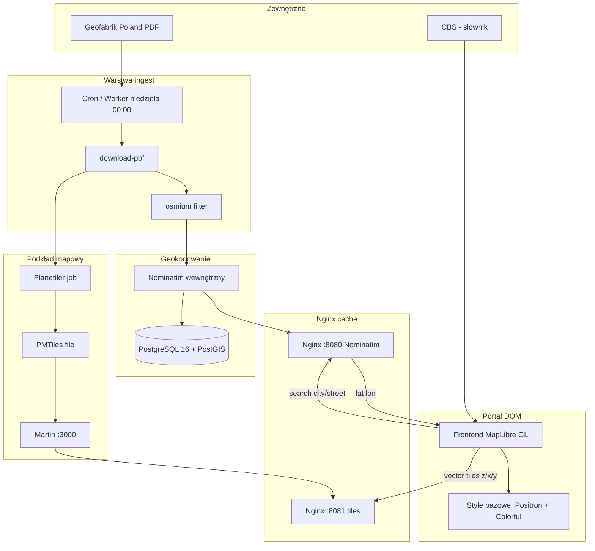

# High Level Design — Serwer map + Nominatim

**Projekt:** Portal DOM  
**Wersja:** 1.0  
**Data:** 2026-08-25

---

## 1. Cel systemu

Portal DOM wymaga dwóch lokalnych usług opartych na danych OpenStreetMap (Polska):

1. **Nominatim** — geokodowanie nazw miejscowości i ulic (z CBS) na współrzędne lat/long
2. **Serwer kafelków wektorowych** — podkład mapowy dla aplikacji frontendowej

Oba serwisy korzystają z tego samego pliku wsadowego **Poland OSM PBF** z Geofabrik.

---

## 2. Kontekst biznesowy

| Problem | Rozwiązanie |
|---------|-------------|
| Publiczny Nominatim: limit 1 req/s, ryzyko blokady | Własna instancja Nominatim |
| Zewnętrzne podkłady map (Versatile, Kartotherian) — zależność, wydajność | Lokalny serwer kafelków |
| Brak danych statystycznych w tych usługach | Jedna instancja dla portalu info i strefy pracownika |
| Wymaganie odporności na niedostępność OSM | Lokalne dane + fallback na poprzednią wersję |

---

## 3. Architektura



---

## 4. Przepływ danych

### 4.1 Geokodowanie (Nominatim)

1. Użytkownik wyszukuje miejscowość/ulicę w Portal DOM
2. Frontend pobiera wyniki z **CBS** (słownik)
3. Po kliknięciu wyniku frontend buduje payload:
   - Miejscowość: `city`, `state`, `featuretype=settlement`
   - Ulica: `street`, `city`, `state`
4. Zapytanie do lokalnego Nominatim `/search` przez Nginx `:8080` (cache tmpfs)
5. Bierze **pierwszy wynik** (`lat`, `lon`)
6. Mapa centruje się na współrzędnych

### 4.2 Podkład mapowy (kafelki)

1. Cron pobiera `poland-latest.osm.pbf` z Geofabrik (niedziela 00:00); osmium tworzy `poland-filtered.osm.pbf` pod Nominatim
2. Planetiler przetwarza **pełny** PBF → `poland.pmtiles` (~5 GB)
3. Martin serwuje kafelki z pliku PMTiles (wewnętrznie)
4. Nginx cache'uje popularne kafelki na `:8081` (tmpfs, 14d)
5. Frontend MapLibre GL pobiera kafelki `{z}/{x}/{y}`
6. Style bazowe: `style_carto_positron.json` (OpenMapTiles / lokalny Martin), `style_versatiles_colorful.json` (Shortbread — CDN do czasu lokalnego tilesetu)

### 4.3 Aktualizacja danych

- **Sukces:** W poniedziałek użytkownik widzi nowe dane z niedzieli
- **Porażka:** Serwowane kafelki/baza sprzed tygodnia — portal działa dalej
- **Docelowo:** Synchronizacja z CBS, konturami, fill, statystykami (osobna procedura)

---

## 5. Komponenty techniczne

| Komponent | Technologia | Rola |
|-----------|-------------|------|
| Nominatim | mediagis/nominatim:5.1 (PostgreSQL 16) | Geokodowanie HTTP API (`IMPORT_STYLE=street`) |
| PostgreSQL + PostGIS | W obrazie Nominatim | Baza geokodowania |
| Osmium | iboates/osmium:latest | Filtr PBF (place/highway/admin) pod Nominatim |
| Planetiler | ghcr.io/onthegomap/planetiler | Generowanie PMTiles z pełnego PBF |
| Martin | ghcr.io/maplibre/martin | Serwer kafelków wektorowych (wewnętrzny) |
| Nginx | nginx:1.27-alpine | HTTP cache: Nominatim `:8080` + kafelki `:8081` |
| Style bazowe | Carto Positron + Versatiles Colorful | MapLibre GL; Positron na lokalnym OMT |

---

## 6. Wymagania niefunkcjonalne

| Wymaganie | Wartość |
|-----------|---------|
| Dostępność | 99.5% (lokalne dane, brak zależności od OSM online) |
| Latencja Nominatim | < 200 ms (p95) |
| Latencja kafelka (cache hit) | < 50 ms |
| Retencja danych | Aktualna + 1 poprzednia wersja PBF/kafelków |
| Replikacja | 2 DC (PKP + drugi ośrodek) — do ustalenia z UFG |
| Bezpieczeństwo | Skanowanie obrazów Docker, brak danych UFG w usługach |

---

## 7. Integracja z Portal DOM

### Istniejące (bez zmian)
- **CBS** — słownik miejscowości/ulic
- **GeoJSON konturów** — obszary administracyjne (województwo → obręb)

### Do zmiany w frontendzie
- URL Nominatim: `nominatim.openstreetmap.org` → lokalny endpoint
- URL kafelków: Versatile/Kartotherian → lokalny endpoint Nginx
- Style: nowe źródło `tiles` w plikach JSON

---

## 8. Odporność i alternatywy

| Scenariusz | Zachowanie |
|------------|------------|
| OSM/Geofabrik niedostępny | Serwuj dane sprzed tygodnia |
| Import Nominatim failed | Stara baza nadal działa |
| Planetiler failed | Stary plik PMTiles nadal serwowany |
| OSM znika z rynku | Podmiana źródła PBF (TomTom/Overture) — wymaga konwersji |

Szczegóły: [osm-alternatives.md](osm-alternatives.md)

---

## 9. Infrastruktura docelowa (UFG)

```
┌─────────────────────────────────────────────────┐
│  DC 1 (PKP)              DC 2 (replika)         │
│  ┌─────────────┐         ┌─────────────┐        │
│  │ Nominatim   │ ◄─────► │ Nominatim   │        │
│  │ Martin      │         │ Martin      │        │
│  │ Nginx       │         │ Nginx       │        │
│  └─────────────┘         └─────────────┘        │
│         ▲                       ▲               │
│         └─────── Portal DOM ────┘               │
└─────────────────────────────────────────────────┘
```

Model replikacji do ustalenia z Fabianem (UFG).

---

## 10. Licencje

| Element | Licencja |
|---------|----------|
| Dane OSM (PBF) | ODbL — wymaga atrybucji © OpenStreetMap |
| Nominatim | GPL-2.0 |
| Osmium (filtr PBF) | GPL-3.0 |
| Planetiler | BSD-3-Clause |
| Martin | MIT / Apache-2.0 |
| Nginx | BSD-2-Clause |

---

## 11. Powiązane dokumenty

- [dependencies.md](dependencies.md) — lista zależności do UFG
- [plan-poc.md](plan-poc.md) — harmonogram POC
- [ufg-fabian-checklist.md](ufg-fabian-checklist.md) — pytania do UFG
- [update-procedure.md](update-procedure.md) — procedura aktualizacji
- [nominatim-optimization.md](nominatim-optimization.md) — optymalizacja datasetu
- [osm-alternatives.md](osm-alternatives.md) — alternatywne źródła danych
