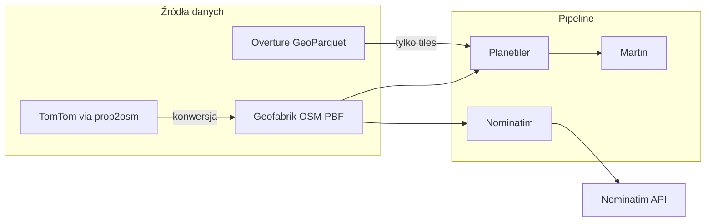

# Alternatywne źródła danych mapowych (PBF)

**Cel:** Opis alternatyw na wypadek niedostępności OpenStreetMap / Geofabrik  
**Wymaganie klienta:** Dokumentacja alternatyw w specyfikacji

---

## 1. Obecne źródło (primary)

| Źródło | URL | Format | Licencja | Częstotliwość aktualizacji |
|--------|-----|--------|----------|---------------------------|
| **Geofabrik** | https://download.geofabrik.de/europe/poland-latest.osm.pbf | OSM PBF | ODbL | ~codziennie |

Geofabrik jest oficjalnym mirror OSM, rekomendowanym przez OpenStreetMap Foundation.

---

## 2. Alternatywne źródła PBF (OSM-compatible)

| Źródło | URL | Uwagi |
|--------|-----|-------|
| **planet.osm.org** | https://planet.openstreetmap.org/ | Pełna planeta (~80 GB+), wymaga wycięcia Polski (osmium) |
| **BBBike** | https://extract.bbbike.org/ | Custom extracts, w tym Polska |
| **Protomaps daily builds** | https://build.protomaps.com/ | Gotowe PMTiles (nie PBF) — alternatywa dla Planetilera |

**Kompatybilność z Planetiler:** ✅ Tak — natywny format OSM PBF  
**Kompatybilność z Nominatim:** ✅ Tak — natywny format OSM PBF

---

## 3. Źródła komercyjne (wymagają konwersji)

### 3.1 TomTom Orbis Maps

| Aspekt | Szczegóły |
|--------|-----------|
| Format | PBF (własny schemat, nie OSM) |
| Kompatybilność Planetiler | ❌ Bezpośrednio nie — wymaga konwersji |
| Kompatybilność Nominatim | ❌ Bezpośrednio nie |
| Rozwiązanie | **prop2osm** (gis-ops) — konwersja TomTom → OSM PBF |
| Koszt | Płatne (kontakt: enquiry@gis-ops.com) |
| URL | https://developer.tomtom.com/tomtom-orbis-maps |

### 3.2 HERE Maps

| Aspekt | Szczegóły |
|--------|-----------|
| Format | Proprietary |
| Rozwiązanie | prop2osm (gis-ops) — konwersja HERE → OSM PBF |
| Koszt | Płatne |

### 3.3 Overture Maps Foundation

| Aspekt | Szczegóły |
|--------|-----------|
| Format | GeoParquet |
| Kompatybilność Planetiler | ✅ Tak (od wersji z obsługą Overture) |
| Kompatybilność Nominatim | ❌ Nie — wymaga konwersji do OSM PBF |
| Koszt | Darmowe (Linux Foundation) |
| URL | https://overturemaps.org/ |
| Uwagi | Inny schemat warstw — wymaga adaptacji stylów |

---

## 4. Wpływ na architekturę

### Kluczowe wnioski

1. **Martin jest agnostyczny** — po wygenerowaniu PMTiles źródło danych nie ma znaczenia
2. **Planetiler** obsługuje: OSM PBF, GeoParquet (Overture), GeoJSON, Shapefile, GeoPackage
3. **Nominatim** wymaga OSM PBF — przy zmianie źródła potrzebna konwersja (prop2osm)
4. **Minimalna zmiana przy OSM outage:** Serwować lokalną kopię sprzed tygodnia (już zaimplementowane w procedurze update)

---

## 5. Rekomendacja dla specyfikacji klienta

> Przyjmujemy, że alternatywne źródła danych (TomTom, HERE, Overture) są dostępne i mogą zastąpić Geofabrik po konwersji do formatu OSM PBF (Nominatim) lub GeoParquet/PBF (Planetiler). Architektura systemu ogranicza zależność od OSM do warstwy ingest — serwowane kafelki i baza geokodowania działają autonomicznie. W przypadku niedostępności Geofabrik system kontynuuje pracę na danych sprzed ostatniej udanej aktualizacji.

---

## 6. Weryfikacja do wykonania (POC)

- [x] Planetiler: potwierdzona obsługa OSM PBF (primary)
- [x] Planetiler: potwierdzona obsługa GeoParquet/Overture (secondary)
- [ ] prop2osm: weryfikacja konwersji TomTom → OSM PBF (opcjonalnie, poza scope POC)
- [x] Martin: potwierdzona obsługa PMTiles niezależnie od źródła generowania

---

## 7. Źródła

- [Planetiler README](https://github.com/onthegomap/planetiler)
- [prop2osm — TomTom/HERE to OSM](https://github.com/gis-ops/prop2osm-public)
- [TomTom Orbis Maps](https://developer.tomtom.com/tomtom-orbis-maps)
- [Overture Maps](https://overturemaps.org/)
- [Geofabrik Downloads](https://download.geofabrik.de/)
