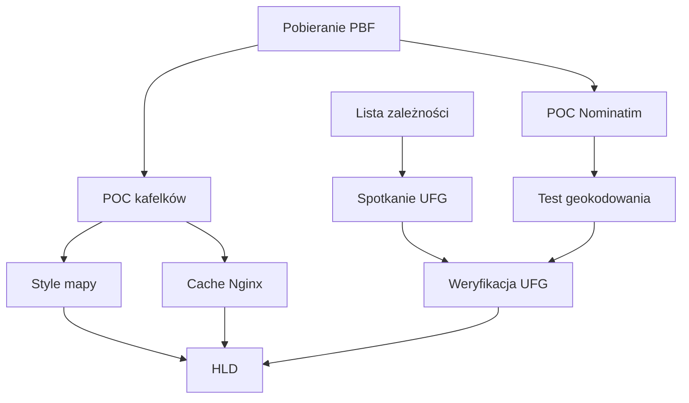

# Plan działań POC — Serwer map + Nominatim

**Okres:** 2 tygodnie (10 dni roboczych)  
**Cel:** Weryfikacja rozwiązania w środowisku lokalnym i przygotowanie do wdrożenia UFG  
**Data:** 2026-08-25

---

## Harmonogram

| # | Zadanie | Odpowiedzialny | Czas | Zależności | Status |
|---|---------|----------------|------|------------|--------|
| 1 | Lista zależności obu usług → UFG | Przemek / Arek | 1 dzień | — | ✅ |
| 2 | POC Nominatim lokalnie (import Poland PBF) | Przemek | 2–3 dni | #1 (równolegle) | |
| 3 | Test geokodowania (payload CBS: miejscowość + ulica) | Przemek | 0.5 dnia | #2 | |
| 4 | POC pipeline kafelków (PBF → Planetiler → Martin) | Przemek | 2–3 dni | PBF pobrany (#5) | |
| 5 | Mechanizm pobierania PBF z Geofabrik | Przemek | 0.5 dnia | — | |
| 6 | Dostosowanie 2 stylów mapy do lokalnych tiles | Przemek / Arek | 1–2 dni | #4 | |
| 7 | Warstwa cache (Nginx) przed Martin | Przemek | 0.5 dnia | #4 | |
| 8 | Spotkanie z Fabianem (UFG) — akceptacja komponentów | Piotr + Fabian | 0.5 dnia | #1 | |
| 9 | Weryfikacja w środowisku UFG | Przemek + Fabian | 2–3 dni | #2, #4, #8 | |
| 10 | HLD + dokumentacja architektury dla klienta | Arek / Przemek | 1 dzień | #1–#7 | |

**Suma szacunkowa:** ~10–12 dni roboczych (z równoległością: ~2 tygodnie kalendarzowe)

---

## Faza 1 — Tydzień 1 (dni 1–5)

### Dzień 1
- [x] Przygotować listę zależności (`docs/dependencies.md`)
- [ ] Wysłać listę do UFG (Piotr → Fabian)
- [ ] Sklonować repo, skonfigurować `.env`
- [ ] Uruchomić `scripts/download-pbf.ps1`

### Dni 2–3
- [ ] `docker compose up nominatim` — import Poland PBF (~2–8 h)
- [ ] Uruchomić `scripts/test-nominatim.ps1` — test Gdańsk, Gdańsk Zielona
- [ ] Udokumentować czas importu i rozmiar bazy

### Dni 4–5
- [ ] `scripts/generate-tiles.ps1` — Planetiler → PMTiles
- [ ] Uruchomić Martin + Nginx cache
- [ ] Sprawdzić kafelki w przeglądarce (MapLibre demo)

---

## Faza 2 — Tydzień 2 (dni 6–10)

### Dni 6–7
- [ ] Style bazowe: `style_carto_positron.json` (lokalny Martin) + `style_versatiles_colorful.json` (Shortbread/CDN)
- [ ] Mapowanie warstw OpenMapTiles vs Shortbread (`styles/layer-mapping.yaml`)
- [ ] Integracja z frontendem Portal DOM (test przez `styles/demo/index.html`)

### Dni 8–9
- [ ] Spotkanie z Fabianem — checklist UFG
- [ ] Deploy POC w środowisku UFG (jeśli akceptacja wstępna)
- [ ] Testy obciążeniowe cache (symulacja użytkowników w Warszawie)

### Dzień 10
- [ ] HLD finalny
- [ ] Raport POC: co działa, co wymaga poprawy
- [ ] Prezentacja dla klienta (spotkanie 9:30)

---

## Dalsze działania (po POC, nie w scope 2 tygodni)

| Zadanie | Priorytet | Szacunek |
|---------|-----------|----------|
| Optymalizacja datasetu Nominatim (tylko miejscowości + ulice) | Średni | 3–5 dni |
| Procedura cyklicznych update PBF + synchronizacja CBS | Wysoki | 5–10 dni |
| Dokumentacja alternatywnych źródeł PBF (TomTom, Overture) | Niski | 1–2 dni |
| Replikacja między 2 DC | Wysoki | 3–5 dni |
| Monitoring i alerty (import failed, API down) | Średni | 2–3 dni |

---

## Kryteria sukcesu POC

1. Nominatim zwraca poprawne lat/long dla ≥90% testowych miejscowości/ulic z CBS
2. Kafelki wektorowe renderują się poprawnie w MapLibre GL z lokalnymi stylami
3. Czas odpowiedzi Nominatim < 200 ms (lokalnie)
4. Czas serwowania kafelka z cache < 50 ms
5. Lista zależności przekazana do UFG
6. Dokumentacja HLD gotowa do review klienta

---

## Diagram zależności zadań

