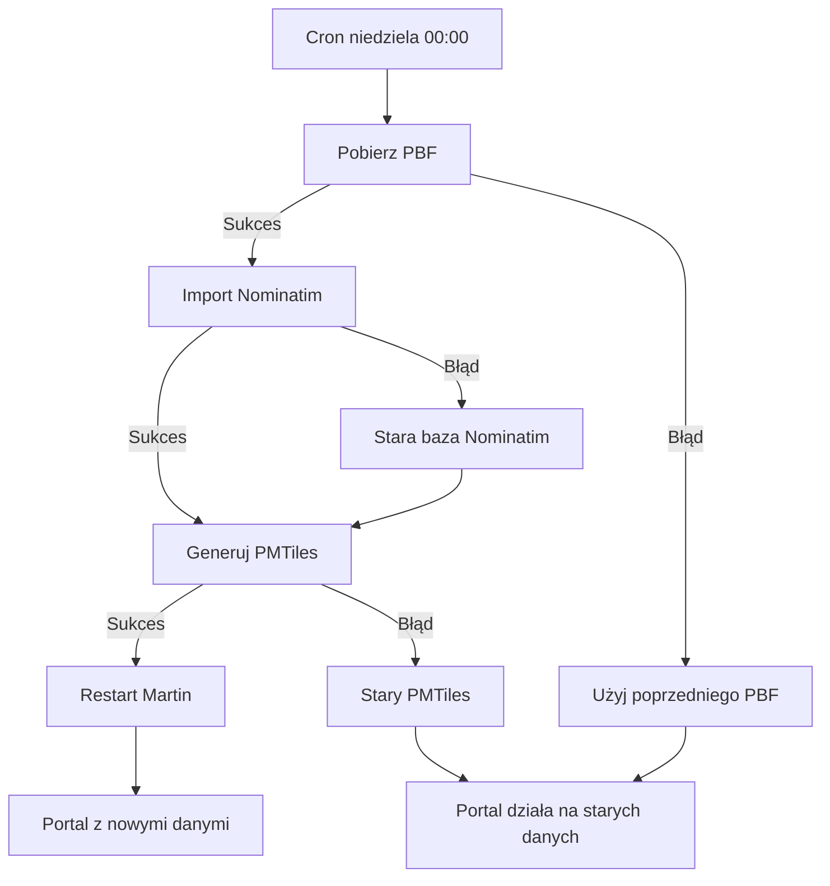

# Procedura aktualizacji danych

**Status:** Faza późniejsza (po POC)  
**Cel:** Cykliczna aktualizacja danych OSM + synchronizacja z CBS

---

## 1. Zakres

| Usługa | Co aktualizujemy | Źródło |
|--------|------------------|--------|
| Nominatim | Baza geokodowania | Geofabrik Poland PBF |
| Serwer kafelków | Plik PMTiles | Geofabrik Poland PBF |
| Portal DOM (CBS) | Słownik miejscowości/ulic | CBS (osobny system) |
| Portal DOM (kontury) | GeoJSON obszarów | Własne źródło |
| Portal DOM (fill) | Dane statystyczne | Własne źródło |

**Ten dokument obejmuje:** Nominatim + kafelki.  
**Synchronizacja z CBS/konturami/fill:** Osobna procedura (szerszy scope).

---

## 2. Harmonogram aktualizacji

| Dzień | Godzina | Akcja |
|-------|---------|-------|
| Niedziela | 00:00 | Pobranie nowego PBF z Geofabrik |
| Niedziela | 00:30–04:00 | Import Nominatim (replika diff lub full) |
| Niedziela | 04:00–08:00 | Generowanie PMTiles (Planetiler) |
| Niedziela | 08:00 | Restart Martin z nowym plikiem PMTiles |
| Poniedziałek | 06:00 | Użytkownicy widzą nowe dane |

**Częstotliwość Geofabrik:** ~codziennie (Poland extract).  
**Rekomendacja:** Aktualizacja **co tydzień** (niedziela) — wystarczająca dla portalu statystycznego.

---

## 3. Procedura krok po kroku

### 3.1 Pobranie PBF + filtr Nominatim

```powershell
.\scripts\download-pbf.ps1
```

- Pobiera `poland-latest.osm.pbf` z Geofabrik (pelny — pod kafelki)
- Buduje `poland-filtered.osm.pbf` (place + highway + admin — **bez POI**)
- Zapisuje poprzednia wersje jako `poland-previous.osm.pbf`
- Loguje w `data/logs/download-YYYY-MM-DD.log`

### 3.2 Aktualizacja Nominatim

**Opcja A: Incremental update (REPLICATION_URL)** — domyslnie w `update-all.ps1`

```yaml
REPLICATION_URL=https://download.geofabrik.de/europe/poland-updates/
IMPORT_STYLE=street
```

Nominatim pobiera diffy; styl `street` **nie indeksuje POI** z diffow (~30 min).

**Opcja B: Full reimport** (zmiana stylu / uszkodzona baza)

```powershell
.\scripts\reimport-nominatim.ps1 -Force
```

Import z `poland-filtered.osm.pbf` (~1–3 h).

### 3.3 Generowanie kafelków

```powershell
.\scripts\generate-tiles.ps1
```

- Planetiler przetwarza **pelny** `poland-latest.osm.pbf` → `poland.pmtiles`
- Poprzedni plik: `poland-previous.pmtiles`

### 3.4 Restart serwisów

```powershell
docker compose restart martin nginx-cache
# Nominatim: restart tylko jeśli full reimport
docker compose restart nominatim
```

---

## 4. Obsługa błędów (fallback)



| Scenariusz | Zachowanie | Alert |
|------------|------------|-------|
| Geofabrik niedostępny | Serwuj dane sprzed tygodnia | Email do ops |
| Import Nominatim failed | Stara baza nadal działa | Email do ops |
| Planetiler failed | Stary PMTiles serwowany | Email do ops |
| Oba failed | Portal działa na starych danych | Pager/email |

---

## 5. Edge case: CBS vs OSM

| Sytuacja | Zachowanie |
|----------|------------|
| Nowa miejscowość w CBS, brak w OSM | Wyszukiwanie w CBS OK, geokodowanie → błąd (akceptowalne) |
| Nowa miejscowość w OSM, brak w CBS | Użytkownik nie widzi w wynikach CBS |
| Nazwa zmieniona w CBS, stara w OSM | Geokodowanie może zwrócić starą lokalizację |

**Docelowa synchronizacja (późniejsza faza):**
- Worker porównuje CBS ↔ Nominatim
- Raport rozbieżności dla zespołu danych
- Nie blokuje aktualizacji OSM

---

## 6. Worker Service (implementacja docelowa)

```
┌─────────────────────────────────────────┐
│  Update Worker (Windows Service / Cron) │
│                                         │
│  1. download-pbf.ps1                    │
│  2. nominatim-update (diff lub full)    │
│  3. generate-tiles.ps1                  │
│  4. health-check (Nominatim + Martin)   │
│  5. notify (email/webhook on failure)   │
│  6. cleanup old data (keep N versions)  │
└─────────────────────────────────────────┘
```

Plik: `scripts/update-all.ps1` (wrapper dla całej procedury)

---

## 7. Retencja danych

| Plik | Retencja |
|------|----------|
| `poland-latest.osm.pbf` | Aktualna wersja (kafelki) |
| `poland-filtered.osm.pbf` | Aktualna wersja (Nominatim) |
| `poland-previous.osm.pbf` | 1 poprzednia wersja |
| `poland.pmtiles` | Aktualna wersja |
| `poland-previous.pmtiles` | 1 poprzednia wersja |
| Logi | 30 dni |

---

## 8. Monitoring

| Metryka | Próg alertu |
|---------|-------------|
| Nominatim API response time | > 500 ms (p95) |
| Martin tile response time | > 200 ms (p95) |
| Ostatnia udana aktualizacja | > 8 dni temu |
| Rozmiar bazy PostgreSQL | > 40 GB (po filtrze street) |
| Wolne miejsce na dysku | < 20 GB |

---

## 9. Checklist przed wdrożeniem produkcyjnym

- [ ] Cron/worker skonfigurowany (niedziela 00:00)
- [ ] Fallback na poprzednią wersję przetestowany
- [ ] Alerty email/webhook skonfigurowane
- [ ] Retencja danych (2 wersje) zweryfikowana
- [ ] Czas aktualizacji zmierzony (< 8 h w niedzielę)
- [ ] Procedura rollback udokumentowana
- [ ] Synchronizacja CBS — plan na późniejszą fazę
